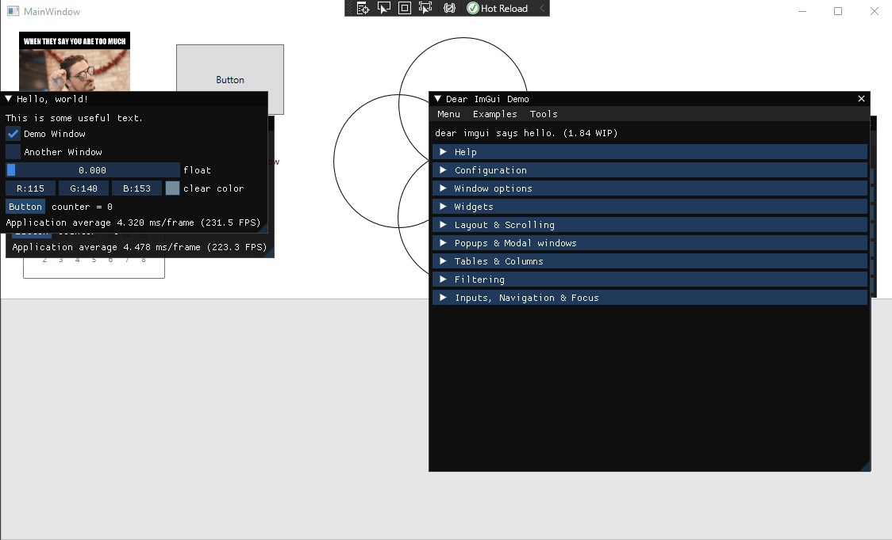

# WPF D3D9 Hook (Milcore)
**WARNING: This is an experimental project which should not be used in production.**

This is a research project on how DirectX interfaces with WPF (Milcore) under the hood. The project does not really server any function. However, it's a proof of concept on how DirectX 9 can be hooked to render ontop of native WPF components.

  

## DirectX 9 in Milcore
The example shows that Milcore handles DirectX in a really efficient way but not constantly rendering. My research suggests that `IDirect3DDevice9::EndScene` is only called when the state changes and it only updates the region of the screen the control bounds resides in.

## Credits
- [Minhook](https://github.com/TsudaKageyu/minhook)
- [ImGui](https://github.com/ocornut/imgui)
- Pattern Scanner (Credits to original owner)

## License
MIT License

Copyright (c) 2020 Liam Riddell

Permission is hereby granted, free of charge, to any person obtaining a copy
of this software and associated documentation files (the "Software"), to deal
in the Software without restriction, including without limitation the rights
to use, copy, modify, merge, publish, distribute, sublicense, and/or sell
copies of the Software, and to permit persons to whom the Software is
furnished to do so, subject to the following conditions:

The above copyright notice and this permission notice shall be included in all
copies or substantial portions of the Software.

THE SOFTWARE IS PROVIDED "AS IS", WITHOUT WARRANTY OF ANY KIND, EXPRESS OR
IMPLIED, INCLUDING BUT NOT LIMITED TO THE WARRANTIES OF MERCHANTABILITY,
FITNESS FOR A PARTICULAR PURPOSE AND NONINFRINGEMENT. IN NO EVENT SHALL THE
AUTHORS OR COPYRIGHT HOLDERS BE LIABLE FOR ANY CLAIM, DAMAGES OR OTHER
LIABILITY, WHETHER IN AN ACTION OF CONTRACT, TORT OR OTHERWISE, ARISING FROM,
OUT OF OR IN CONNECTION WITH THE SOFTWARE OR THE USE OR OTHER DEALINGS IN THE
SOFTWARE.
